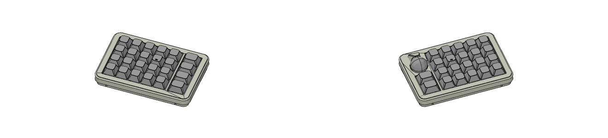
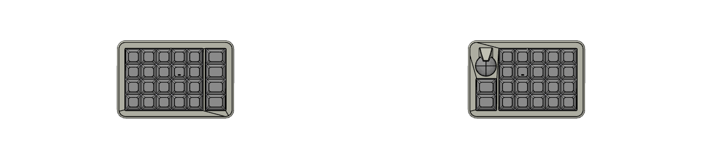

# Tenkeydess
テンキーレスではないです。テンキーです。

- 人差し指トラボ派のための分割オーソリニアです。
- 配列の合理性とエルゴノミクスすぎないクリーンなデザインを両立していることが特徴です。
- Choc V2 19mmピッチ、Tadpoleマウントです。
- [Auto-Keyboard-Design-Kit](https://auto-kdk.pages.dev/)で生成されました。

## プレビュー

- 3Dビュー

- トップビュー

## パーツリスト

|パーツ名|数量|購入リンク|
|---|---|---|
|ワイヤレスコントローラー|2|https://booth.pm/ja/items/6604431|
|コンスルー(2.5mm, 9pin)|4|https://booth.pm/ja/items/6604431|
|14mmマウスセンサーモジュール|1|https://booth.pm/ja/items/6520217|
|FFCケーブル(6ピン 0.5mmピッチ 50mm)|1|https://www.amazon.co.jp/dp/B0FHQ65HB7|
|バッテリー|2|自己責任でご購入ください|
|USB-Cケーブル|1||
|Choc V2スイッチ|46||
|Chocソケット|46||
|キーキャップ|46||
|ダイオード|46|https://shop.yushakobo.jp/products/a0800di-02-100|
|Tadopoleマウント|8-12||
